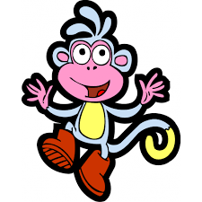

## A) Ajouter Normalize.css et Main.css (en local)
- Veuillez ajouter `normalize.css` en local dans `./css/normalize.css`
- Veuillez créer/utiliser `./css/main.css`
- Et les lier dans le `<head>` dans cet ordre :
```
<link rel="stylesheet" href="./css/normalize.css">
<link rel="stylesheet" href="./css/main.css">
```

## B) Ajouter un favicon (à la racine, avec `./`)
- Veuillez ajouter un favicon et le référencer avec `./`
- Exemple :
```
<link rel="icon" href="./favicon.ico">
```

## C) Menu de navigation : 3 liens + bons `href`
- Il manque un lien (vous devez avoir 3 liens : expérience, compétences, formation)
- Votre lien “Ma formation” pointe vers `#comp` : veuillez le faire pointer vers `#formation`
- Exemple attendu :
```
<a href="#experience">Mon expérience</a>
<a href="#competences">Mes compétences</a>
<a href="#formation">Ma formation</a>
```

## D) Ajouter la section “Mon expérience”
- Veuillez ajouter une section “Mon expérience” avec un titre `<h2>` et du contenu (paragraphe ou liste)

## E) Photo dans le header : ouvrir dans un nouvel onglet + sécurité
- Le clic sur l’image doit ouvrir l’image dans un nouvel onglet
- Veuillez ajouter `target="_blank"` et `rel="noopener noreferrer"`
- Exemple :
```
<a class="logo" href="./img/avatar-noe.png" target="_blank" rel="noopener noreferrer">
  
</a>
```

## F) Retirer les styles inline (mettre dans `main.css`)
- Vous avez des `style="..."` directement dans le HTML (ex: couleur violette, fond gris)
- Veuillez déplacer ces styles dans `./css/main.css`

## G) Ne pas mettre la taille des images dans le HTML
- Vous avez `width="300"` dans une image
- Veuillez gérer la taille dans le CSS, pas dans le HTML

## Autres
- Attention à l'indentation et à la lisibilité du code
